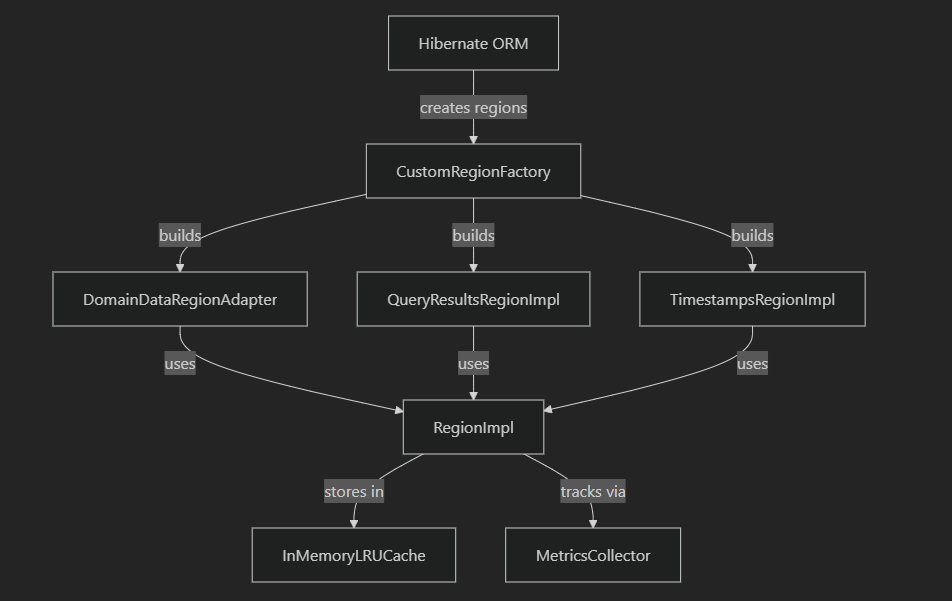
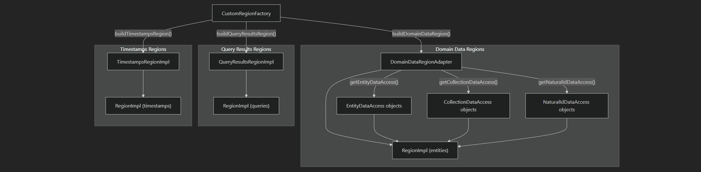
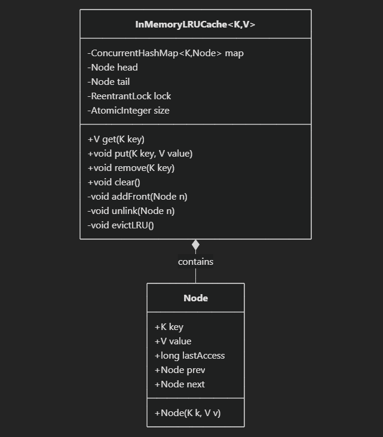
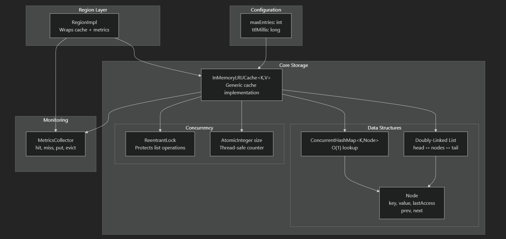

# Hibernate Custom Cache

A custom cache implementation for Hibernate ORM built after learning Hibernate. This project implements different concurrency strategies and provides a thread-safe caching solution.

## Architecture Overview

The custom cache system follows a layered architecture where Hibernate ORM creates different types of cache regions through a factory pattern, each backed by a core implementation that uses an in-memory LRU cache with comprehensive monitoring.



_This diagram shows the high-level flow from Hibernate ORM through the CustomRegionFactory to different region implementations, all backed by the core RegionImpl and InMemoryLRUCache with metrics collection._

## What it does

This cache supports multiple concurrency strategies:

- **Read-Only**: For immutable data
- **Read-Write**: Full CRUD with soft locking
- **Non-Strict Read-Write**: Eventual consistency
- **Transactional**: ACID compliance (planned)

## Key Features

- Thread-safe operations using ConcurrentHashMap
- LRU eviction policy with configurable TTL
- Soft locking mechanism to prevent cache corruption
- Performance metrics and monitoring
- Integration with Hibernate's second-level cache

## Region Factory Pattern

The `CustomRegionFactory` creates three distinct types of cache regions, each optimized for different data access patterns:



_This diagram illustrates how the CustomRegionFactory builds different types of regions and how the DomainDataRegionAdapter coordinates various data access strategies for entity management._

### Region Types

- **Timestamps Regions**: Track cache invalidation timestamps
- **Query Results Regions**: Cache query execution results
- **Domain Data Regions**: Cache entity data with specialized access patterns

## LRU Cache Implementation

The core caching mechanism uses a thread-safe in-memory LRU cache with the following architecture:



_This UML class diagram shows the InMemoryLRUCache class structure with its internal data structures and the Node class that represents individual cache entries._

### Data Structure Flow

The LRU cache maintains data in a doubly-linked list with sentinel nodes for efficient operations:


_This diagram shows how the doubly-linked list maintains the LRU order with sentinel nodes at head and tail, where Node1 is the Most Recently Used (MRU) and Node4 is the Least Recently Used (LRU)._

### Cache Operations Flow



_This diagram illustrates the complete cache architecture showing how configuration flows through the system, the internal data structures used, and how metrics are collected._

## Tech Stack

- Java 17
- Hibernate 6.4.4
- Maven
- JUnit 5 for testing
- H2 database for integration tests

## Project Structure

```
src/main/java/com/example/cache/
├── access/           # Different concurrency strategies
├── factory/          # CustomRegionFactory for Hibernate
├── region/           # Cache region implementations
├── storage/          # InMemoryLRUCache
├── metrics/          # Performance tracking
└── config/           # Configuration management
```

## System Flow

The diagrams above show how the different components work together:

1. **Hibernate Integration**: Hibernate ORM calls `CustomRegionFactory` to create cache regions
2. **Region Creation**: The factory creates specialized regions (timestamps, queries, domain data)
3. **Core Implementation**: All regions delegate to `RegionImpl` for core functionality
4. **Data Storage**: `RegionImpl` uses `InMemoryLRUCache` for actual data storage
5. **Monitoring**: All operations are tracked by `MetricsCollector` for performance analysis

### Key Design Patterns

- **Factory Pattern**: `CustomRegionFactory` creates different region types
- **Adapter Pattern**: `DomainDataRegionAdapter` coordinates different data access strategies
- **Strategy Pattern**: Different concurrency strategies for different data types
- **Observer Pattern**: `MetricsCollector` observes cache operations

## Usage

Add to your Hibernate configuration:

```properties
hibernate.cache.use_second_level_cache=true
hibernate.cache.region.factory_class=com.example.cache.factory.CustomRegionFactory
hibernate.cache.max_entries=10000
hibernate.cache.ttl_seconds=3600
```

## Testing

The project includes comprehensive tests with real performance results:

**Performance Benchmarks:**

- **High throughput reads**: 434,782 ops/sec (10,000 operations in 23ms)
- **High throughput writes**: 156,250 ops/sec (2,500 operations in 16ms)
- **Mixed workload**: 571,428 ops/sec (4,000 operations in 7ms)
- **Sustained load**: 2.4M ops/sec over 10 seconds with 0% error rate
- **Cache warming**: 277,777 ops/sec (5,000 operations in 18ms)
- **Lock contention**: 100% success rate (1,000 locks in 2.6s)
- **Memory pressure**: Handles 1,500 operations in 9ms with proper eviction

**Test Coverage:**

- Unit tests for individual components
- Integration tests with Hibernate
- Performance tests with concurrent access
- Concurrency tests for thread safety

Run tests with:

```bash
mvn test
```

## What I learned

- Hibernate's internal caching mechanisms
- Java concurrency and thread safety
- Soft locking patterns
- Performance optimization techniques
- Testing concurrent systems

This was a great way to understand how Hibernate's second-level cache works under the hood and practice advanced Java concepts.
